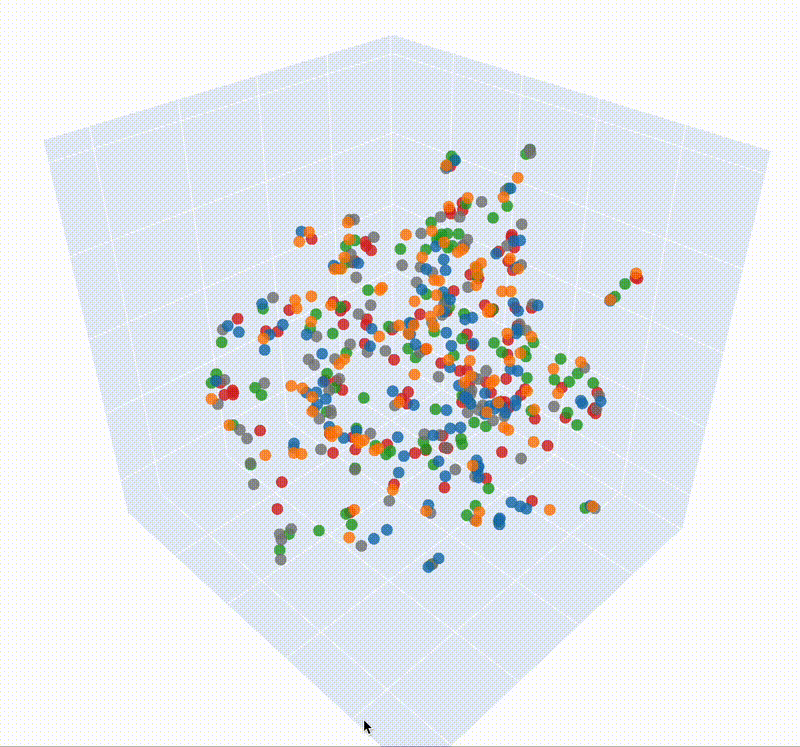
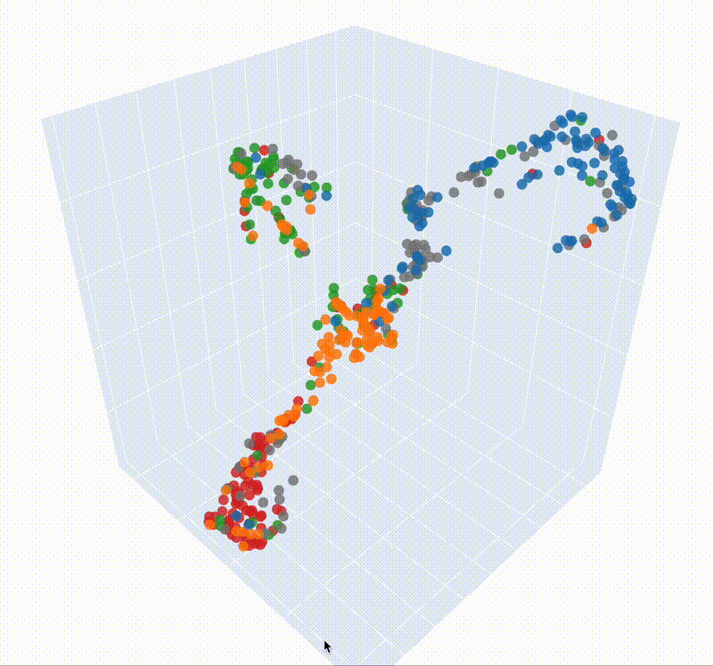
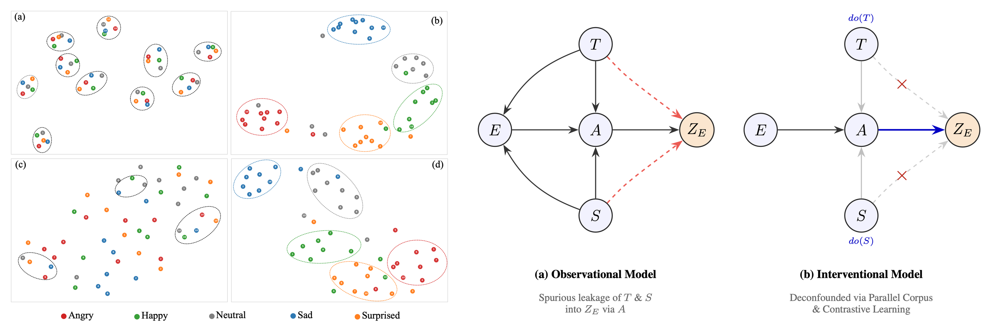
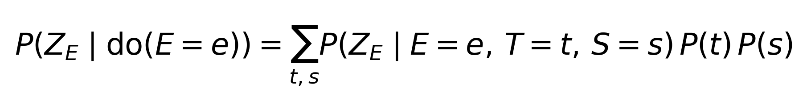
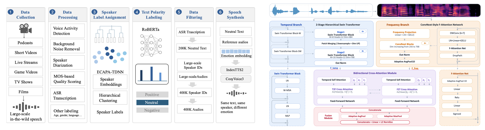

<div align="center">

# RecdSER

### Representation Learning via Causal Deconfounding for Speech Emotion Recognition

[](https://github.com/Biotan/RecdSER)
[](https://github.com/Biotan/RecdSER)
[](https://huggingface.co/datasets/jingangtan/SynthEmoVoice)
[](https://huggingface.co/jingangtan/RecdSER)
[](https://www.python.org/)

_A causally-deconfounded, time–frequency dual-domain framework for robust speech emotion representation & recognition._

</div>

---

## Overview

Speech emotion recognition (SER) models are notoriously **confounded** by two nuisance
factors entangled in the acoustic signal: the **textual semantics** of *what* is said and
the **speaker timbre** of *who* is speaking. As a result, models often learn shortcuts tied
to content or identity rather than the emotion itself.

**RecdSER** attacks this problem from a **causal** perspective. We formulate SER with a
**Structural Causal Model (SCM)** and, following the **backdoor criterion**, design a
**deconfounding** procedure that removes the spurious influence of text and speaker on the
learned emotion representation.

To make backdoor adjustment tractable at scale, we synthesize **SynthEmoVoice** — a
large-scale **parallel** emotional speech corpus in which the *same text* spoken by the
*same speaker* is rendered across **7 distinct emotions**. This parallel structure lets the
model observe emotion variation while text and speaker are held fixed, directly enabling
deconfounding.

On top of the deconfounded representation, we devise a specialized SER model built upon a
**time–frequency dual-domain architecture with bidirectional** modelling, tailored to the
characteristics of emotional speech.

<div align="center">

<table width="960">
  <tr>
    <td valign="top" align="center" width="50%"></td>
    <td valign="top" align="center" width="50%"></td>
  </tr>
  <tr>
    <td valign="top" align="center"><sub><b>Fig. 1 — emotion2vec</b> — 3D embedding visualization on the ESD dataset without fine-tuning. Different colors represent different emotions.</sub></td>
    <td valign="top" align="center"><sub><b>Fig. 2 — RecdSER</b> — 3D embedding visualization on the ESD dataset without fine-tuning. Different colors represent different emotions.</sub></td>
  </tr>
</table>

<br/>

<!-- Fig.3 & Fig.4 : equal-height merged image (rendered as one, always aligned) -->


<table width="960">
  <tr>
    <td valign="top" align="center" width="50%"><sub><b>Fig. 3</b> — Embedding space visualizations on the ESD dataset. (a, b) Single speaker with 10 text contents across 5 emotions; (c, d) 10 speakers with a single text content across 5 emotions. Numbers denote text IDs in (a, b) and speaker IDs in (c, d). Panels (a, c) show emotion2vec and (b, d) show RECDSER. While emotion2vec is dominated by semantics and speaker traits, RECDSER forms distinct emotion clusters with minimal interference from text or speaker timbre.</sub></td>
    <td valign="top" align="center" width="50%"><sub><b>Fig. 4</b> — Causal deconfounding framework (structural causal model + backdoor adjustment):</sub><br/></td>
  </tr>
</table>

<br/>

<!-- Fig.5 & Fig.6 : equal-height merged image -->


<table width="960">
  <tr>
    <td valign="top" align="center" width="56%"><sub><b>Fig. 5</b> — SynthEmoVoice parallel emotional-speech synthesis pipeline</sub></td>
    <td valign="top" align="center" width="44%"><sub><b>Fig. 6</b> — Time–frequency dual-domain SER model architecture</sub></td>
  </tr>
</table>

</div>

### Supported emotions

RecdSER predicts **7** emotion categories:

```
Angry · Disgust · Fear · Happy · Sad · Surprise · Neutral
```

---

## Resources

| Resource | Link |
|----------|------|
| 📄 Paper | *RecdSER: Representation Learning via Causal Deconfounding for Speech Emotion Recognition* |
| 💻 Code | https://github.com/Biotan/RecdSER |
| 🤗 Dataset — **SynthEmoVoice** | https://huggingface.co/datasets/jingangtan/SynthEmoVoice |
| 🤗 Model weights — **RecdSER** | https://huggingface.co/jingangtan/RecdSER |

### Released checkpoints

Three checkpoints are released under the [RecdSER weights repo](https://huggingface.co/jingangtan/RecdSER):

| Checkpoint | Training recipe | Use case |
|------------|-----------------|----------|
| **`recdser_base.safetensors`** | Representation learning on **15k-hour** SynthEmoVoice | Embedding extraction |
| **`recdser_finetune_base.safetensors`** | Fine-tuned on open-source emotional speech + partially-licensed data (**440 h**) | Embedding extraction **and** emotion label prediction |
| **`recdser_finetune_large.safetensors`** | **Stage-1** fine-tune on SynthEmoVoice → **Stage-2** fine-tune on 440 h open-source + partially-licensed data | Embedding extraction **and** emotion label prediction |

> All weights are plain `.safetensors` (state-dict + JSON metadata, no `pickle`).
> Checkpoints with a classification head carry a `label_class` metadata field, so
> `inference.py` resolves class names automatically.

---

## Part 1 · Getting Started

### Installation

```bash
conda create -n recdser python==3.10 -y
conda activate recdser
pip install -r requirements.txt
```

### Download weights

Download the checkpoint(s) you need from the
[🤗 model repo](https://huggingface.co/jingangtan/RecdSER) and place them under
`./checkpoints/`:

```
checkpoints/
├── recdser_base.safetensors
├── recdser_finetune_base.safetensors
└── recdser_finetune_large.safetensors
```

---

## Part 2 · Usage

### Inference

RecdSER exposes a single unified entry point — `inference.py`. Three independent
switches decide what to emit; any combination is allowed (`--output_embedding`,
`--output_label`, `--output_probs`).

#### 1) Extract embeddings with the representation model

Use the base (backbone-only) checkpoint to obtain a **768-D L2-normalized** utterance
embedding:

```bash
python -m RecdSER.inference \
    --checkpoint ./checkpoints/recdser_base.safetensors \
    --audio  a.wav  b.wav  ./some_dir/ \
    --output_embedding \
    --output embeddings.npy \
    --device cuda
```

`embeddings.npy` is an `(N, 768)` float array in input order. Python API:

```python
from RecdSER.inference import load_audio, run_inference

wavs = [load_audio("a.wav"), load_audio("b.wav")]
result = run_inference(
    wavs,
    checkpoint="./checkpoints/recdser_base.safetensors",
    device="cuda",
    output_embedding=True,
)
print(result["embedding"].shape)   # (2, 768)
```

#### 2) Predict labels / extract embeddings with a fine-tuned model

Fine-tuned checkpoints support **all three** outputs. Predict the top-1 emotion with
per-class probabilities:

```bash
python -m RecdSER.inference \
    --checkpoint ./checkpoints/recdser_finetune_large.safetensors \
    --audio  sample.wav \
    --output_label --output_probs
```

Example output (one tab-separated line per audio):

```
sample.wav  label=Angry  probs={Angry:0.962, Disgust:0.006, Fear:0.005, Happy:0.007, Sad:0.006, Surprise:0.005, Neutral:0.009}
```

Emit **everything** (label + probs + embedding) into a single `.npz`:

```bash
python -m RecdSER.inference \
    --checkpoint ./checkpoints/recdser_finetune_large.safetensors \
    --audio  sample.wav \
    --output_label --output_probs --output_embedding \
    --output result.npz
```

Python API:

```python
from RecdSER.inference import load_audio, run_inference

result = run_inference(
    [load_audio("sample.wav")],
    checkpoint="./checkpoints/recdser_finetune_large.safetensors",
    device="cuda",
    output_embedding=True,
    output_label=True,
    output_probs=True,
)
print(result["class_labels"])     # ['Angry', 'Disgust', 'Fear', 'Happy', 'Sad', 'Surprise', 'Neutral']
print(result["label"])            # ['Angry']
print(result["probs"].shape)      # (1, 7)
print(result["embedding"].shape)  # (1, 768)
```

> Any fine-tuned checkpoint always exposes its 768-D embedding via
> `model.backbone(...)`, so `--output_embedding` works regardless of the head.

**Supported audio**: `.wav .flac .mp3 .ogg .m4a .aac`. Multi-channel / non-16 kHz files
are auto-converted to mono 16 kHz.

### Fine-tuning on your own data

The `finetune_esd/` directory is a self-contained, config-driven training example. To
fine-tune on your own dataset, follow the ESD recipe.

**1) Prepare data.** Put your audio files under some root directory, and create a catalog
`.txt` file (refer to [`finetune_esd/ESD.txt`](finetune_esd/ESD.txt)). The catalog is a
comma-separated file whose header **must** contain at least the columns `audio_path` and
`emotion_tag`; `audio_path` is a **relative** path (joined with `audio_root` at load time):

```
dataset_name,audio_path,emotion_tag,text,language,duration,speaker_id,speaker_gender
ESD,ESD/0001/Angry/0001_000583.wav,Angry,,拜托，别跟我提到笔记本电脑。,zh,2.907,ESD_0001,F
...
```

**2) Configure.** Copy / edit `finetune_esd/config.yaml`:

```yaml
dataset:
  catalog_path: /path/to/your_catalog.txt
  audio_root:   /path/to/audio_root                 # prepended to audio_path
  target_emotions: ["Angry", "Disgust", "Fear", "Happy", "Sad", "Surprise", "Neutral"]
  emotion_mapping: {}          # e.g. {"Surprise": "Happy"} to merge classes
  val_ratio: 0.1               # 0.0 -> all data for training; else stratified train/val

model:
  swin_ffa_checkpoint: ./checkpoints/recdser_base.safetensors   # initialize backbone
  hidden_dim: 256

training:
  num_epochs: 30
  lr: 1.0e-5
  monitor_metric: WA           # WA / UA / WF1
```

The number of classes is inferred automatically from `target_emotions` (+ optional
`emotion_mapping`); the derived label list is written into the saved checkpoint's
`label_class` metadata so inference resolves names for free.

**3) Train.**

Single GPU:

```bash
python -m RecdSER.finetune_esd.train \
    --config RecdSER/finetune_esd/config.yaml
```

Multi-GPU (DDP, 8 GPUs on one node):

```bash
torchrun --nproc_per_node=8 --rdzv_backend=c10d --rdzv_endpoint=localhost:0 \
    -m RecdSER.finetune_esd.train \
    --config RecdSER/finetune_esd/config.yaml
```

The best model (`best_model.safetensors`) and TensorBoard logs are written under the
configured `output_dir`.

**4) Inference with your model.** Once training finishes, reuse the inference commands
above — just point `--checkpoint` at your trained `best_model.safetensors`:

```bash
python -m RecdSER.inference \
    --checkpoint /path/to/best_model.safetensors \
    --audio sample.wav \
    --output_label --output_probs
```

---

## Project Layout

```
RecdSER/
├── modules/                 # Network definitions only (no I/O, no training)
│   ├── backbone.py          #   Time–frequency dual-domain backbone (wav -> 768-D)
│   ├── head.py              #   MLP classification head
│   ├── classifier.py        #   EmotionClassifier = backbone + head
│   └── config.yaml          #   Backbone hyper-parameters
├── checkpoints/             # Downloaded .safetensors weights go here
├── finetune_esd/            # Config-driven fine-tuning example (catalog -> train/val)
│   ├── train.py             #   entry point
│   ├── dataset.py           #   catalog parsing + stratified split
│   ├── utils.py             #   train / evaluate (WA / UA / WF1)
│   ├── config.yaml          #   training hyper-params + label spec
│   └── ESD.txt              #   example catalog
├── imgs/                    # Paper figures
├── inference.py             # Unified inference: embedding / label / probs
├── requirements.txt
└── README.md
```

---

## Citation

If you find RecdSER or SynthEmoVoice useful in your research, please consider citing:

```bibtex
@inproceedings{recdser,
  title     = {RecdSER: Representation Learning via Causal Deconfounding for Speech Emotion Recognition},
  author    = {Tan Jingang and Zixun Sun and Shuang Zhao and Yating Zhang},
  booktitle = {Proceedings},
  year      = {2026}
}
```

## License

Released under the MIT license.
